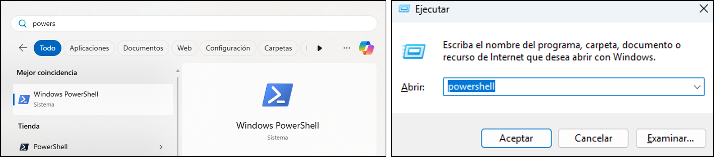
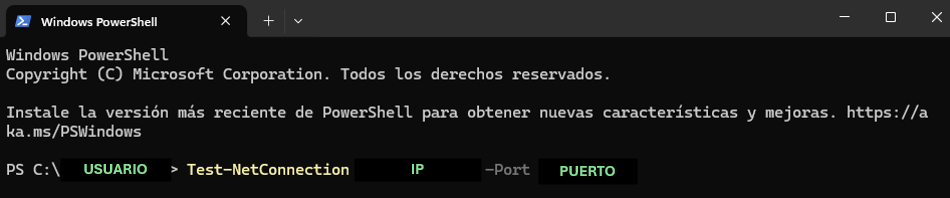
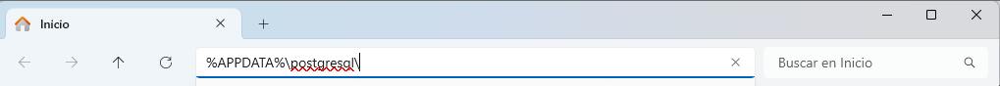
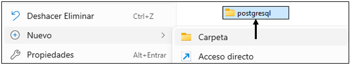
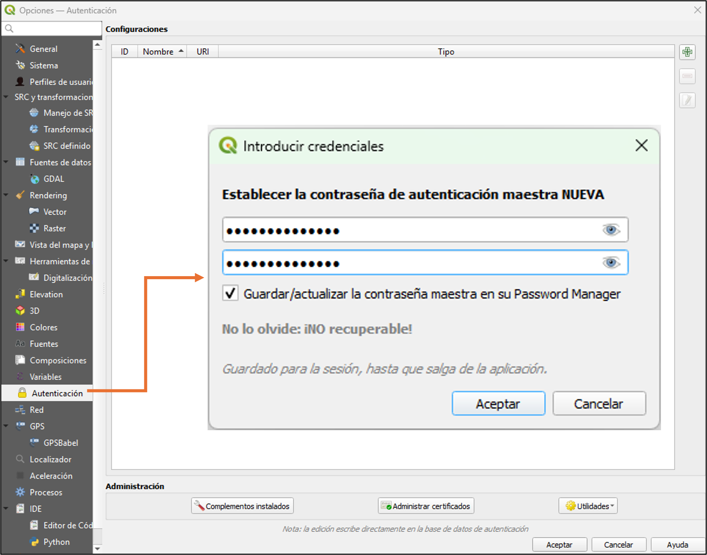

## Conexión a PostgreSQL desde QGIS

1.  **Versión de QGIS:** Verifique que QGIS esté actualizado a la versión 3.40.9 para asegurar compatibilidad con extensiones y complementos de acceso a PostgreSQL.

2.  **Verificación de acceso a la red:** Para comprobar la conectividad al servidor y al puerto (IP del computador) donde se encuentra la base de datos PostgreSQL.

    -   Abrir **PowerShell de Windows** desde el buscador o desde el ejecutador de programas (tecla de Windows+R).\
        

    -   Escribir el siguiente código en Windows PowerShell + Enter:

        ```         
        Test-NetConnection <IP computador> -Port <Puerto>=
        ```

    -   El enunciado *TRUE* indica que se puede acceder al puerto desde el computador, la conexión está lista para iniciar el proceso de vinculación a la base de datos.

        

        Si no puede conectarse, revise la configuración de los datos del IP del computador o puerto, así como la red desde la que está intentando acceder.

3.  **Archivo pg_service.conf:**

    Este archivo es importante porque ....

    -   En primer lugar, compruebe si existe una carpeta denominada *postgresql* copiando la siguiente ruta en le buscador de archivos de su ordenador:

        ```         
        %APPDATA%\postgresql\
        ```

        {fig-align="center"}

        En caso de error, cree la carpeta denominada *postgresql*, escribiendo la siguiente ruta en el explorador de archivos:

        ```         
        %APPDATA%
        ```

        {width="488"}

    -   En la carpeta creada, guarde el archivo .conf enviado desde la oficina principal. Este contiene información acerca del lugar donde se encuentra la base de datos:

        {fig-align="center"}

        ```         
        [Base de datos] 
        host=Dirección del servidor al que se conectará el sistema (IP o dirección del dominio).
        port=Puerto de conexión al servicio (base de datos o servidor).
        dbname=Nombre de la base de datos a la que el sistema se conectará. 
        sslmode=prefer - Conexión. 
        ```

4.  **Activación de la contraseña maestra y creación de credenciales cifradas**

    Abra QGIS, en la barra de herramientas, vaya a *Configuración* y seleccione *Opciones*.

    

    En la ventana desplegada busque *Autenticación,* le solicitará la contraseña maestra, una clave única implementada por el software QGIS para proteger las credenciales de conexiones como a la base de datos postgreSQL, acuérdese de ella porque en caso de pérdida, no se puede recuperar. Vale aclarar que la contraseña maestra y la solicitada para el acceso directamente a la base de datos, son diferentes.

    

    , digítela y dele click en Aceptar. Se resalta que

5.  Seleccione **PostgreSQL** y cree una conexión nueva.

6.  Complete parámetros de host, puerto, base `sig_fedearroz_fna` y active SSL si aplica.

7.  

8.  Guarde credenciales en `pg_service.conf` o `.pgpass` para evitar contraseñas en texto plano.

## Cargar capas

-   Añada `stg.veredas_norm` y defina simbología graduada por `area_ha`.
-   Cree mapas temáticos combinando veredas con capas raster (NDVI, precipitación).

## Consultas desde QGIS

Utilice el panel **DB Manager** para ejecutar SQL y crear vistas materiales.

``` sql
CREATE MATERIALIZED VIEW carto.v_veredas_fuente_hidrica AS
WITH fuentes AS (
  SELECT geom
  FROM ref.hidrografia_principal
),
simplificado AS (
  SELECT vereda_codigo,
         vereda_nombre,
         municipio,
         ST_SimplifyPreserveTopology(geom, 5) AS geom
  FROM stg.veredas_norm
)
SELECT s.*, ST_Distance(s.geom, f.geom) AS distancia_m
FROM simplificado s
CROSS JOIN LATERAL (
  SELECT geom
  FROM fuentes
  ORDER BY s.geom <-> geom
  LIMIT 1
) AS f;
```

Recargue la vista en QGIS y configure actualizaciones automáticas tras `REFRESH MATERIALIZED VIEW`.

## Salidas cartográficas

-   Diseñe plantillas de impresión con logotipo Fedearroz en la esquina inferior.
-   Exporte mapas en PDF y PNG, guardándolos en `reportes_cartografia/` con nomenclatura `YYYYMMDD_tema.pdf`.
-   Documente estilos QGIS (`.qml`) en la carpeta `consultas/estilos_qgis/`.

## Integración con Quarto

Inserte mapas renderizados como imágenes o `iframe` cuando se publique el libro.

``` markdown
{fig-align="center"}
```

Mantenga activos los enlaces relativos para que GitHub Pages genere el sitio correctamente.